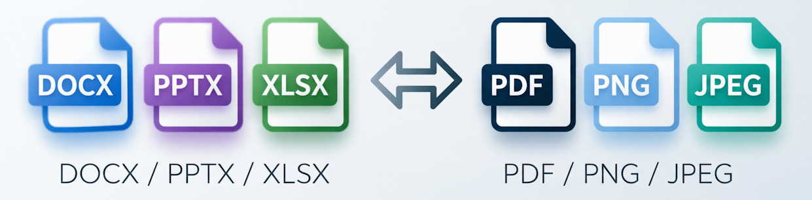

# office-print

<p align="center">
  
</p>

**office-print** — pure-Rust library and CLI for converting Office documents (DOCX, PPTX, XLSX) to **PDF, PNG, or JPEG**.

No LibreOffice. No Chromium. No Docker. No cloud APIs. Just a single binary powered by [Typst](https://github.com/typst/typst).

---

## Features

### Input formats

| Format | Key capabilities |
|--------|-----------------|
| **DOCX** | Paragraphs, inline formatting (bold/italic/underline/color), tables, images, drawing shapes, ordered/nested lists, syntax-highlighted code, headers/footers, page setup, TOC, footnotes/endnotes, math equations |
| **PPTX** | Slides, text boxes, shapes, tables (with theme-based table styles), images, slide masters, speaker notes, gradients, shadow/reflection effects, SmartArt |
| **XLSX** | Sheets, cell formatting, merged cells, column widths, row heights, conditional formatting (DataBar, IconSet), charts, headers/footers |

### Output formats

| Format | Description |
|--------|-------------|
| **PDF** (default) | PDF 1.7, optional PDF/A-2b archival compliance |
| **PNG** | Lossless raster, one image per page (2× pixel density) |
| **JPEG** | Lossy raster, configurable quality (default 92), one image per page |

### Key capabilities

- **PDF/A-2b** — archival-compliant output via `--pdf-a`
- **WASM** — runs in browsers and Node.js (`wasm` feature, 12 exported functions)
- **Embedded font extraction** — DOCX/PPTX embedded fonts auto-extracted and deobfuscated
- **macOS Office font auto-discovery** — bundled + cloud font caches searched automatically
- **Zero external dependencies** — single standalone binary, no runtime needed

---

## Installation

### CLI (pre-built binary)

Install the CLI tool system-wide via Cargo:

```sh
cargo install office-print-cli
```

This downloads and compiles the latest release. Requires Rust ≥ 1.89.

> **Tip:** On Linux/macOS, `cargo install` puts binaries in `~/.cargo/bin/` — make sure it's in your `$PATH`.

### CLI (Docker)

```sh
docker build -t office-print https://github.com/devpilgrin/office-print.git
docker run --rm -v $(pwd):/data office-print /data/report.docx -o /data/report.pdf
```

Or use a pre-built image (when published):

```sh
docker run --rm -v $(pwd):/data ghcr.io/devpilgrin/office-print /data/report.docx -o /data/report.pdf
```

### CLI (from source)

```sh
git clone https://github.com/devpilgrin/office-print.git
cd office-print
cargo build --release -p office-print-cli
./target/release/office-print --help
```

### Library (Rust)

Add to your `Cargo.toml`:

```toml
[dependencies]
office-print = "0.6"

# With PDF merge/split support
office-print = { version = "0.6", features = ["pdf-ops"] }

# With WASM bindings (for browser/Node.js targets)
office-print = { version = "0.6", features = ["wasm"] }
```

### Library (JavaScript / WASM)

**From npm** (when published):

```sh
npm install office-print
```

**From source:**

```sh
# One-time: install wasm-pack
cargo install wasm-pack

# Build
./build_wasm.sh        # macOS / Linux
# or
./build_wasm.ps1       # Windows PowerShell
```

Then use the generated `crates/office-print/pkg/` directory in your JS project:

```js
import init, { convertDocxToPdf, convertDocxToPng } from './pkg/office-print.js';

await init();
const pdf = convertDocxToPdf(docxBytes);
const png = convertDocxToPng(docxBytes);
```

> **No Rust toolchain needed** when installing from npm — the WASM binary is pre-compiled and ready to use.

### Platform support

| Platform | CLI | Library | WASM |
|----------|-----|---------|------|
| Windows (x86_64) | ✅ | ✅ | ✅ |
| macOS (x86_64 / ARM) | ✅ | ✅ | ✅ |
| Linux (x86_64) | ✅ | ✅ | ✅ |
| Browser (any) | — | — | ✅ |
| Node.js | — | — | ✅ |

---

## Quick Start

### CLI

```sh
# PDF (default)
office-print report.docx -o report.pdf

# PNG
office-print report.docx --format png -o report.png

# JPEG with custom quality
office-print slides.pptx --format jpeg --jpeg-quality 85 -o slides.jpg

# Batch convert to PDF
office-print *.docx --outdir pdfs/

# Multi-page raster → page-1.png, page-2.png, ...
office-print spreadsheet.xlsx --format png --outdir images/

# With options
office-print slides.pptx --paper a4 --landscape --format pdf
office-print spreadsheet.xlsx --sheets "Sheet1,Summary"
office-print document.docx --pdf-a
```

### Library (Rust)

```rust
use office_print::config::{ConvertOptions, Format, OutputFormat};

// PDF (default)
let result = office_print::convert("report.docx").unwrap();
std::fs::write("report.pdf", result.as_pdf_bytes().unwrap()).unwrap();

// PNG
let options = ConvertOptions {
    output_format: OutputFormat::Png,
    ..Default::default()
};
let result = office_print::convert_bytes(&data, Format::Docx, &options).unwrap();
for (i, page) in result.output.as_raster_pages().unwrap().iter().enumerate() {
    std::fs::write(format!("page-{}.png", i + 1), page).unwrap();
}

// JPEG
let options = ConvertOptions {
    output_format: OutputFormat::Jpeg,
    jpeg_quality: 85,
    ..Default::default()
};
let result = office_print::convert_bytes(&data, Format::Docx, &options).unwrap();
```

### WASM (JavaScript)

```js
import init, { convertDocxToPdf, convertDocxToPng, convertToJpeg } from './pkg/office-print.js';

await init();

const docxBytes = new Uint8Array(await file.arrayBuffer());

const pdfBytes  = convertDocxToPdf(docxBytes);
const pngBytes  = convertDocxToPng(docxBytes);
const jpegBytes = convertToJpeg(docxBytes, "docx", 85);
```

> **Available WASM functions:** `convertToPdf`, `convertToPng`, `convertToJpeg` (generic, format string + optional JPEG quality), plus format-specific variants: `convertDocxToPdf`/`ToPng`/`ToJpeg`, `convertPptxToPdf`/`ToPng`/`ToJpeg`, `convertXlsxToPdf`/`ToPng`/`ToJpeg`.

---

## CLI Options

| Flag | Description |
|------|-------------|
| `-o, --output <PATH>` | Output file path (single input only) |
| `--outdir <DIR>` | Output directory for batch/multi-page conversion |
| `--format <FMT>` | Output format: `pdf` (default), `png`, or `jpeg` |
| `--jpeg-quality <N>` | JPEG quality 1–100 (default: 92) |
| `--paper <SIZE>` | Paper size: `a4`, `letter`, `legal` |
| `--landscape` | Force landscape orientation |
| `--pdf-a` | Produce PDF/A-2b compliant output |
| `--pdf-ua` | Produce PDF/UA-1 accessible output (implies `--tagged`) |
| `--tagged` | Tagged PDF with document structure (H1–H6, P, Table) |
| `--sheets <NAMES>` | XLSX sheet filter (comma-separated) |
| `--slides <RANGE>` | PPTX slide range (e.g. `1-5` or `3`) |
| `--font-path <DIR>` | Additional font directory (repeatable) |
| `--streaming` | Streaming mode for large XLSX (row-chunked, bounds memory) |
| `--streaming-chunk-size <N>` | Rows per chunk in streaming mode (default: 1000) |
| `--metrics` | Print per-stage timing to stderr |
| `-j, --jobs <N>` | Parallel conversion jobs (default: CPU cores) |

### Subcommands

| Command | Description |
|---------|-------------|
| `merge <files...> -o output.pdf` | Merge multiple PDFs into one |
| `split <input> --pages 1-5,10-15 --outdir <dir>` | Split PDF by page ranges |
| `serve --port 3000` | Start HTTP conversion server (requires `server` feature) |

---

## Architecture

```
Input (.docx/.pptx/.xlsx)
    │
    ▼
[Parser] → [IR (Intermediate Representation)] → [Typst Codegen] → [Typst Compile] → PagedDocument
                                                                                       │
                                                                   ┌───────────────────┼───────────────────┐
                                                                   ▼                   ▼                   ▼
                                                             typst-pdf::pdf()   typst-render + PNG   typst-render + JPEG
                                                                   │                   │                   │
                                                                   ▼                   ▼                   ▼
                                                              PDF bytes           PNG bytes           JPEG bytes
```

---

## Library API

```rust
// File-based conversion
let result = office_print::convert("input.docx")?;
let result = office_print::convert_with_options("input.pptx", &options)?;

// In-memory conversion
let result = office_print::convert_bytes(&data, Format::Xlsx, &options)?;

// IR → PDF directly
let pdf = office_print::render_document(&ir_document)?;

// Access output
match &result.output {
    OutputData::Pdf(pdf) => { /* Vec<u8> */ },
    OutputData::Raster { pages, format } => { /* Vec<Vec<u8>> */ },
}
```

---

## Related Projects

This project is a fork of [office2pdf](https://github.com/developer0hye/office2pdf) by @developer0hye, extended with:
- PNG and JPEG raster output via Typst's `typst-render`
- Refactored `OutputData` enum for multi-format results
- Expanded WASM bindings (12 functions across 3 formats)
- Performance benchmarks comparing PDF vs PNG vs JPEG

---

## Documentation

Project documentation is in the [`doc/`](doc/) directory:

| Document | Description |
|----------|-------------|
| [PRD](doc/PRD.md) | Product Requirements Document — target users, functional/non-functional requirements, architecture |
| [METHODOLOGY](doc/METHODOLOGY.md) | Universal software project methodology (how we work) |
| [CLAUDE](doc/CLAUDE.md) | Project rules for Claude: TDD, naming, types, git workflow, release procedure |
| [PPTX Font Resolution](doc/PPTX_FONT_RESOLUTION.md) | How PPTX font resolution works on macOS |

---

## License

Licensed under [Apache License, Version 2.0](LICENSE).

© 2026 [devpilgrin](https://github.com/devpilgrin) and contributors.
